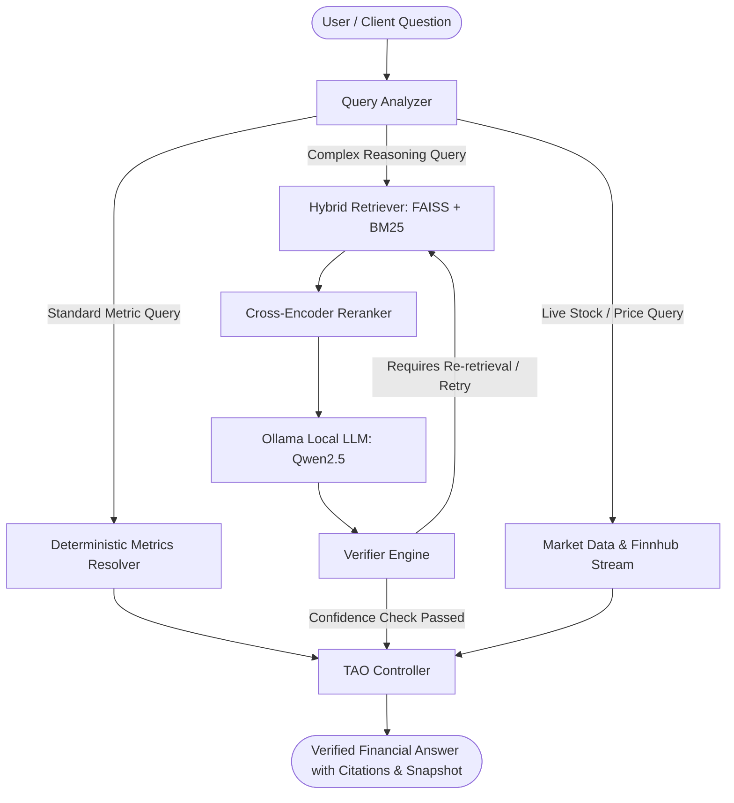

# 📈 TAO-Fin: Verifier-Guided Financial Reasoning & Analysis Engine

[](https://www.python.org/)
[](https://fastapi.tiangolo.com/)
[](https://github.com/facebookresearch/faiss)
[](https://ollama.ai/)
[](LICENSE)

**TAO-Fin** is an enterprise-grade, verifier-guided financial question-answering and market intelligence engine. It combines **hybrid retrieval-augmented generation (RAG)**, **deterministic accounting resolvers**, **multi-step Thought-Action-Observation (TAO) reasoning**, and a **source-grounded verifier** to eliminate hallucinations in complex financial queries, SEC EDGAR filing interpretations, and live market analysis.

---

## 🌟 Key Features

- 🔍 **Hybrid Multi-Stage Retrieval Engine**:
  - **Dense Vector Search**: Powered by `sentence-transformers` and `FAISS` for high-accuracy semantic matching.
  - **Sparse Lexical Search**: Powered by `rank-bm25` for precise financial term, metric name, and ticker matching.
  - **Cross-Encoder Re-ranking**: Utilizes `cross-encoder/ms-marco-MiniLM-L-6-v2` to rank the most relevant financial chunks and table excerpts.

- 🧠 **TAO (Thought-Action-Observation) Reasoning Pipeline**:
  - Iterative reasoner that coordinates query analysis, document retrieval, metric resolution, and verification.
  - Prevents arithmetic and factual hallucinations by routing quantitative financial metrics to deterministic formula solvers.

- ✅ **Verifier-Guided Grounding**:
  - Dedicated verification engine (`verifier.py`) cross-references model claims against retrieved SEC filing text and parsed financial tables.
  - Generates verifiable confidence scores and triggers iterative re-refinement if evidence is weak or ungrounded.

- 📊 **SEC EDGAR Automated Ingestion & Parsing**:
  - Direct integration with SEC EDGAR for real-time extraction and indexing of 10-K, 10-Q, and 8-K filings.
  - High-precision table parsing and financial statement normalization (Balance Sheet, Income Statement, Cash Flow).

- ⚡ **Real-Time & Historical Market Data**:
  - **Finnhub WebSocket Integration**: Live US tick/trade streaming with staleness detection.
  - **Multi-Exchange Coverage**: Real-time quotes and historical price charts across US, NSE, and BSE exchanges (with yfinance fallback).

- 📈 **FinanceBench Evaluation Suite**:
  - End-to-end evaluation harness for quantitative benchmarking against the industry-standard **FinanceBench** dataset.

---

## 🏗️ Architecture Overview



---

## 📂 Project Structure

```text
tao-fin-capstone/
├── backend/
│   ├── app/
│   │   ├── db/                 # Database models and SQLite initialization
│   │   │   ├── database.py
│   │   │   └── models.py
│   │   ├── routes/             # FastAPI REST endpoints
│   │   │   ├── analyze.py      # Core /api/analyze TAO reasoning endpoint
│   │   │   ├── companies.py    # Company profile, sync, and filing management
│   │   │   ├── market.py       # Live quotes, history, and WebSocket stream
│   │   │   └── sec.py          # Direct SEC filing discovery and lookups
│   │   ├── services/           # Core AI, RAG, TAO, and data processing services
│   │   │   ├── bm25_index.py        # Lexical BM25 search
│   │   │   ├── calculator.py        # Financial arithmetic solver
│   │   │   ├── chunker.py           # Text and table chunking engine
│   │   │   ├── company_service.py   # Filing synchronization coordinator
│   │   │   ├── embeddings.py        # SentenceTransformer embedding wrapper
│   │   │   ├── financebench.py      # FinanceBench runner logic
│   │   │   ├── financial_lookup.py  # SEC statement lookup utilities
│   │   │   ├── finnhub_websocket.py # Finnhub real-time trade manager
│   │   │   ├── hybrid_retriever.py  # Hybrid FAISS + BM25 retriever
│   │   │   ├── market_data.py       # yfinance and Finnhub quote provider
│   │   │   ├── market_snapshot.py   # Comprehensive market summary builder
│   │   │   ├── metrics_resolver.py  # Deterministic financial ratio resolver
│   │   │   ├── ollama_client.py     # Local Ollama client & streaming parser
│   │   │   ├── query_analyzer.py    # Intent classifier & entity extractor
│   │   │   ├── rag_index.py         # Pipeline builder and vector indexer
│   │   │   ├── rag_pipeline.py      # Standard RAG execution flow
│   │   │   ├── reranker.py          # Cross-encoder re-ranking service
│   │   │   ├── sec_client.py        # SEC EDGAR API client
│   │   │   ├── sec_parser.py        # Filing text and HTML parser
│   │   │   ├── table_parser.py      # HTML / text table structure extractor
│   │   │   ├── tao_controller.py    # Multi-step state manager
│   │   │   ├── tao_pipeline.py      # Main verifier-guided TAO pipeline
│   │   │   ├── vector_store.py      # FAISS index storage & search
│   │   │   └── verifier.py          # Source grounding verification engine
│   │   └── main.py             # FastAPI entry point & lifecycle hooks
│   ├── tests/                  # Unit and integration test suite
│   ├── .env.example            # Environment variable configuration template
│   └── requirements.txt        # Backend dependencies
│
├── evaluation/
│   ├── financebench_evaluator.py  # Evaluator metrics and scoring engine
│   ├── run_financebench.py        # Benchmark CLI execution script
│   └── results/                   # Benchmark execution outputs & logs
│
├── .gitignore
└── README.md
```

---

## 🛠️ Prerequisites

Before setting up the project, ensure you have:

1. **Python 3.10+** installed.
2. **Ollama** installed and running locally ([Download Ollama](https://ollama.ai/)).
   - Pull the recommended model:
     ```bash
     ollama pull qwen2.5:1.5b-instruct
     ```
3. **Finnhub API Key** (Free tier available at [finnhub.io](https://finnhub.io/register)).
4. **SEC User-Agent** (Required contact string per SEC fair access guidelines, e.g., `YourName user@example.com`).

---

## 🚀 Installation & Setup

### 1. Clone the Repository

```bash
git clone https://github.com/vedantreshamdalal/updated-tao_fin_capstone.git
cd updated-tao_fin_capstone
```

### 2. Set Up Python Virtual Environment

```bash
# Windows
python -m venv venv
venv\Scripts\activate

# Linux / macOS
python3 -m venv venv
source venv/bin/activate
```

### 3. Install Dependencies

```bash
cd backend
pip install -r requirements.txt
```

### 4. Configure Environment Variables

Create a `.env` file in the `backend/` directory by copying `.env.example`:

```bash
cp .env.example .env
```

Edit `backend/.env` with your credentials and configuration:

```ini
# SEC EDGAR Contact (Required by SEC)
SEC_USER_AGENT=YourName your.email@example.com

# Finnhub API Key (For live US stock quotes & WebSocket trade streaming)
FINNHUB_API_KEY=your_finnhub_api_key_here

# Ollama LLM Configuration
OLLAMA_BASE_URL=http://localhost:11434
OLLAMA_MODEL=qwen2.5:1.5b-instruct
OLLAMA_NUM_CTX=16384

# Re-ranker Model
RERANKER_MODEL=cross-encoder/ms-marco-MiniLM-L-6-v2

# Database (Optional, defaults to local SQLite in data/)
# DATABASE_URL=sqlite:///./data/tao_fin.db
```

---

## 💻 Running the Application

Start the FastAPI server from the `backend/` directory:

```bash
cd backend
uvicorn app.main:app --host 0.0.0.0 --port 8000 --reload
```

Once running, access the interactive API documentation:
- **Swagger UI**: [http://localhost:8000/docs](http://localhost:8000/docs)
- **ReDoc**: [http://localhost:8000/redoc](http://localhost:8000/redoc)

---

## 📡 API Reference

### 1. Financial Analysis & Reasoning

#### `POST /api/analyze`
Submits a financial query for verifier-guided TAO analysis. Automatically syncs filings on-demand if the company has not been indexed yet.

**Request Body:**
```json
{
  "question": "What was Apple's gross margin and operating revenue in FY2023?"
}
```

**Response Example:**
```json
{
  "question": "What was Apple's gross margin and operating revenue in FY2023?",
  "answer": "For fiscal year 2023, Apple reported total net sales (operating revenue) of $383,285 million and a gross margin of 44.13%...",
  "verified": true,
  "confidence": 0.96,
  "sources": [
    {
      "form": "10-K",
      "filing_date": "2023-11-03",
      "excerpt": "Total net sales: $383,285 million; Total cost of sales: $214,137 million..."
    }
  ],
  "market_snapshot": {
    "ticker": "AAPL",
    "last_price": 182.52,
    "market_cap": 2850000000000
  }
}
```

---

### 2. Company & Filing Management

| Method | Endpoint | Description |
|---|---|---|
| `GET` | `/api/companies` | List all synced companies and their filing counts |
| `GET` | `/api/companies/{ticker}` | Get detailed profile, synced filings, and cached quote for a ticker |
| `POST` | `/api/companies/{ticker}/sync` | Trigger full SEC EDGAR filing download, table extraction, and quote sync |

---

### 3. Market Data & Streaming

| Method | Endpoint | Description |
|---|---|---|
| `GET` | `/api/market/quote/{symbol}?exchange=US` | Fetch live quote (`US`, `NSE`, or `BSE`) |
| `GET` | `/api/market/history/{symbol}?period=1mo` | Fetch historical OHLCV chart data |
| `GET` | `/api/market/stream/status` | Check Finnhub WebSocket connection and active subscriptions |
| `POST` | `/api/market/stream/subscribe` | Subscribe ticker to real-time WebSocket trade stream |
| `POST` | `/api/market/stream/unsubscribe` | Unsubscribe ticker from WebSocket trade stream |
| `GET` | `/api/market/stream/{symbol}` | Get latest real-time trade tick for a subscribed symbol |

---

### 4. Direct SEC Lookups

| Method | Endpoint | Description |
|---|---|---|
| `GET` | `/api/sec/company/{cik}` | Get SEC company metadata, registered tickers, and exchanges |
| `GET` | `/api/sec/company/{cik}/filings` | Get list of available 10-K / annual reports on EDGAR |

---

## 🧪 Evaluation & Benchmarking

To benchmark the TAO pipeline against the **FinanceBench** financial reasoning benchmark:

```bash
# Run benchmark on FinanceBench dataset
python evaluation/run_financebench.py --limit 50 --output evaluation/results/benchmark_run.json
```

Benchmark output metrics include:
- **Retrieval Hit Rate / MRR** on financial statements
- **Numerical Verification Precision**
- **Hallucination Rate Comparison** (Standard RAG vs TAO Verifier)

---

## 🛡️ Verification & Anti-Hallucination Mechanism

```text
┌────────────────────────────────────────────────────────┐
│               TAO Verification Cycle                   │
├────────────────────────────────────────────────────────┤
│ 1. Hypothesis Generation: Extracted LLM / Rule Output   │
│ 2. Grounding Check: Match numbers to raw SEC Tables    │
│ 3. Formula Validation: Recompute ratios deterministically│
│ 4. Verifier Verdict: PASSED (Deliver) / FAILED (Retry) │
└────────────────────────────────────────────────────────┘
```

1. **Exact-Match Validation**: Any monetary figure, percentage, or fiscal-year ratio mentioned in the response is traced back to specific cell values extracted from SEC 10-K/10-Q tables.
2. **Deterministic Arithmetic**: Ratios like Return on Equity (ROE), Debt-to-Equity, Net Margin, and Current Ratio are computed via `calculator.py` and `metrics_resolver.py` rather than allowing the LLM to perform mental arithmetic.
3. **Graceful Fallbacks**: When SEC filing evidence is sparse or ambiguous, the pipeline falls back to certified market aggregators while transparently noting data provenance.

---

## 📜 License

This project is licensed under the MIT License.
